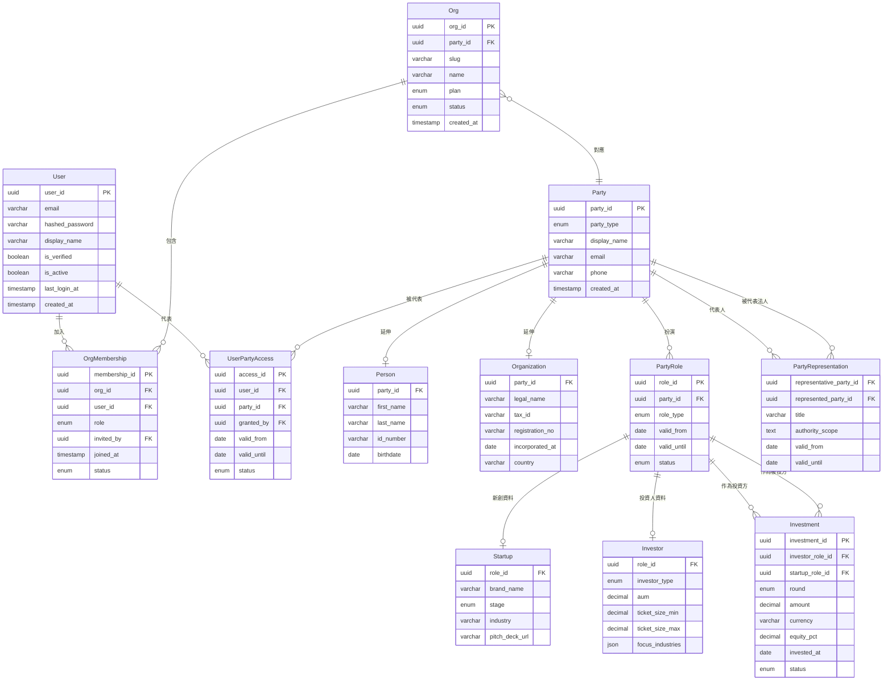

# 資料架構知識筆記

## Party Pattern + 組織 + 使用者 + RBAC

> **適用情境**：新創生態系平台，投資人與新創方皆可為自然人或法人；使用者帳號與商業實體分離，支援一人代表多個 Party；權限以角色層級（Admin / Member / Viewer）於組織內控制。

---

## 一、核心設計原則

| 原則             | 說明                                                |
| ---------------- | --------------------------------------------------- |
| 身份與實體分離   | `User`（登入者）≠ `Party`（商業主體），兩側獨立演化 |
| 角色與當事人分離 | 同一個 Party 可同時扮演多種角色（新創、投資人…）    |
| 組織為權限邊界   | RBAC 掛在 `OrgMembership`，以 `org_id` 隔離資料     |
| 代表關係可稽核   | `UserPartyAccess` 支援有效期與撤銷，留存授權紀錄    |

---

## 二、整體架構圖（ER Diagram）



---

## 三、各層資料表說明

### 層次一：使用者層（Authentication）

負責登入身份管理，與商業實體完全分離。

**User**

| 欄位            | 型別      | 說明           |
| --------------- | --------- | -------------- |
| user_id         | UUID PK   |                |
| email           | VARCHAR   | 登入帳號，唯一 |
| hashed_password | VARCHAR   |                |
| display_name    | VARCHAR   |                |
| avatar_url      | VARCHAR   |                |
| is_verified     | BOOLEAN   | Email 驗證狀態 |
| is_active       | BOOLEAN   | 帳號啟用狀態   |
| last_login_at   | TIMESTAMP |                |
| created_at      | TIMESTAMP |                |

---

### 層次二：組織層（Multi-tenancy + RBAC）

平層結構，作為平台的租戶單位與權限邊界。

**Org**

| 欄位       | 型別       | 說明                                   |
| ---------- | ---------- | -------------------------------------- |
| org_id     | UUID PK    |                                        |
| party_id   | FK → Party | 對應的商業主體                         |
| slug       | VARCHAR    | URL 識別碼，唯一（如 `acme-ventures`） |
| name       | VARCHAR    | 組織顯示名稱                           |
| logo_url   | VARCHAR    |                                        |
| plan       | ENUM       | `free` / `pro` / `enterprise`          |
| status     | ENUM       | `active` / `suspended`                 |
| created_at | TIMESTAMP  |                                        |

**OrgMembership**

| 欄位          | 型別      | 說明                             |
| ------------- | --------- | -------------------------------- |
| membership_id | UUID PK   |                                  |
| org_id        | FK → Org  |                                  |
| user_id       | FK → User |                                  |
| role          | ENUM      | `admin` / `member` / `viewer`    |
| invited_by    | FK → User | 邀請人                           |
| joined_at     | TIMESTAMP |                                  |
| status        | ENUM      | `active` / `invited` / `removed` |

> **角色權限說明**
>
> - `admin`：管理成員、編輯所有資料、刪除組織
> - `member`：讀寫組織內資料，不可管理成員
> - `viewer`：唯讀

---

### 層次三：代表授權層（User ↔ Party）

一個使用者可代表多個 Party，授權關係可精細控制有效期與撤銷。

**UserPartyAccess**

| 欄位        | 型別       | 說明                  |
| ----------- | ---------- | --------------------- |
| access_id   | UUID PK    |                       |
| user_id     | FK → User  |                       |
| party_id    | FK → Party | 被代表的 Party        |
| granted_by  | FK → User  | 授權人                |
| valid_from  | DATE       |                       |
| valid_until | DATE       | 可為 NULL（長期授權） |
| status      | ENUM       | `active` / `revoked`  |

---

### 層次四：當事人層（Party Pattern）

商業世界的主體，不分自然人或法人統一以 Party 表示，再延伸各自欄位。

**Party**

| 欄位         | 型別      | 說明                      |
| ------------ | --------- | ------------------------- |
| party_id     | UUID PK   |                           |
| party_type   | ENUM      | `person` / `organization` |
| display_name | VARCHAR   | 統一顯示名稱              |
| email        | VARCHAR   |                           |
| phone        | VARCHAR   |                           |
| created_at   | TIMESTAMP |                           |

**Person（自然人延伸）**

| 欄位       | 型別       | 說明     |
| ---------- | ---------- | -------- |
| party_id   | FK → Party |          |
| first_name | VARCHAR    |          |
| last_name  | VARCHAR    |          |
| id_number  | VARCHAR    | 身分證號 |
| birthdate  | DATE       |          |

**Organization（法人延伸）**

| 欄位            | 型別       | 說明       |
| --------------- | ---------- | ---------- |
| party_id        | FK → Party |            |
| legal_name      | VARCHAR    | 登記名稱   |
| tax_id          | VARCHAR    | 統編／稅號 |
| registration_no | VARCHAR    |            |
| incorporated_at | DATE       |            |
| country         | VARCHAR    |            |

---

### 層次五：角色層（PartyRole）

Party 在業務上扮演的角色，同一個 Party 可同時持有多個角色。

**PartyRole**

| 欄位        | 型別       | 說明                                     |
| ----------- | ---------- | ---------------------------------------- |
| role_id     | UUID PK    |                                          |
| party_id    | FK → Party |                                          |
| role_type   | ENUM       | `startup` / `investor` / `founder` / ... |
| valid_from  | DATE       |                                          |
| valid_until | DATE       |                                          |
| status      | ENUM       | `active` / `inactive`                    |

**Startup（新創專屬）**

| 欄位           | 型別           | 說明                                   |
| -------------- | -------------- | -------------------------------------- |
| role_id        | FK → PartyRole |                                        |
| brand_name     | VARCHAR        |                                        |
| stage          | ENUM           | `pre-seed` / `seed` / `series_a` / ... |
| industry       | VARCHAR        |                                        |
| pitch_deck_url | VARCHAR        |                                        |

**Investor（投資人專屬）**

| 欄位             | 型別           | 說明                                     |
| ---------------- | -------------- | ---------------------------------------- |
| role_id          | FK → PartyRole |                                          |
| investor_type    | ENUM           | `angel` / `vc` / `cvc` / `family_office` |
| aum              | DECIMAL        | 管理資產規模                             |
| ticket_size_min  | DECIMAL        |                                          |
| ticket_size_max  | DECIMAL        |                                          |
| focus_industries | JSON           |                                          |

---

### 層次六：關係層

**Investment（投資關係）**

| 欄位             | 型別           | 說明                   |
| ---------------- | -------------- | ---------------------- |
| investment_id    | UUID PK        |                        |
| investor_role_id | FK → PartyRole | role_type = 'investor' |
| startup_role_id  | FK → PartyRole | role_type = 'startup'  |
| round            | ENUM           | 投資輪次               |
| amount           | DECIMAL        |                        |
| currency         | VARCHAR        |                        |
| equity_pct       | DECIMAL        |                        |
| invested_at      | DATE           |                        |
| status           | ENUM           | `active` / `exited`    |

**PartyRepresentation（自然人代表法人，選用）**

| 欄位                    | 型別       | 說明     |
| ----------------------- | ---------- | -------- |
| representative_party_id | FK → Party | 自然人   |
| represented_party_id    | FK → Party | 法人     |
| title                   | VARCHAR    | 職稱     |
| authority_scope         | TEXT       | 授權範圍 |
| valid_from              | DATE       |          |
| valid_until             | DATE       |          |

---

## 四、情境對照表

| 情境                     | 資料結構                                                     |
| ------------------------ | ------------------------------------------------------------ |
| 自然人註冊為投資人       | User → UserPartyAccess → Party(person) → PartyRole(investor) |
| 法人新創加入平台         | Org → Party(organization) → PartyRole(startup)               |
| 顧問管理多家公司         | 一個 User，多筆 UserPartyAccess 指向不同 Party               |
| 新創員工唯讀權限         | OrgMembership(role = viewer)                                 |
| 同一人既是投資人也有新創 | 同一 Party，兩筆 PartyRole                                   |
| 法人同時被投資也對外投資 | 同一 Party，多筆 PartyRole                                   |
| 自然人代表法人簽約       | PartyRepresentation 關聯兩個 Party                           |

---

## 五、權限判斷流程

```
使用者發出請求
    │
    ▼
OrgMembership 中是否有此 User？
    ├── 否 → 403 Forbidden
    └── 是 → 取得 role
               ├── viewer  → 僅允許 GET
               ├── member  → 允許 GET / POST / PUT
               └── admin   → 全部操作 + 成員管理
```

---

## 六、相關設計模式參考

| 模式                               | 適用時機                                         |
| ---------------------------------- | ------------------------------------------------ |
| **Single Table Inheritance (STI)** | 角色差異小，全部放同一張表以 type 欄位區分       |
| **Class Table Inheritance (CTI)**  | 本筆記採用，主表 + 延伸表，彈性高                |
| **Party Pattern**                  | 企業級系統（CRM、ERP、金融、法律）的標準建模方式 |
| **Multi-tenancy Row-level**        | 所有查詢強制帶入 `org_id` 作為資料隔離邊界       |

---

_參考應用領域：投資管理平台、股權管理（Cap Table）、CRM、SaaS Multi-tenant 系統、法律合約系統_
